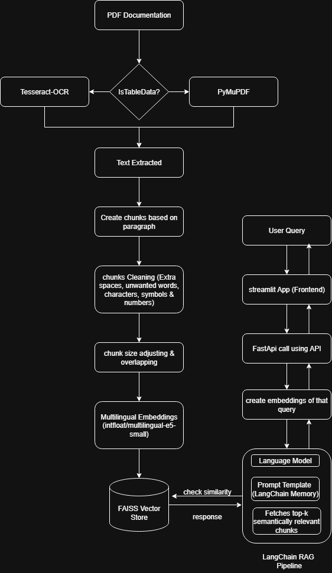

# 📘 Bangla PDF RAG - Bangla AI Teacher

## 🌐 Introduction

Bangla PDF RAG (Retrieval-Augmented Generation) is a cutting-edge intelligent question-answering system designed specifically for Bangla-language documents. The system allows users to upload Bangla PDFs and receive precise, context-aware answers to their questions in Bangla. At its core, it leverages the Retrieval-Augmented Generation (RAG) framework—combining the power of large language models with dense retrievers for information-grounded responses.

To ensure high-quality extraction from complex Bangla PDFs, we use a hybrid approach:

**Tesseract OCR:** Employed for robust full-text extraction, especially effective for scanned PDFs and documents without selectable text. Tesseract supports Bangla script and leverages layout-awareness through its LSTM-based recognition engine, enabling accurate text parsing.

**PyMuPDF (fitz):** Used to parse embedded text and extract structured data like tables. Based on experimental observation, PyMuPDF shows superior performance in layout-preserved extraction compared to other tools when dealing with digital PDFs.

The system automatically selects between OCR or direct text parsing based on the nature of the document (scanned or digital), ensuring optimal processing in each case.

## 🧠 Layout Awareness
Both Tesseract OCR and PyMuPDF are layout-aware to a certain extent:

- Tesseract understands document layout through spatial positioning and segmentation, helping it reconstruct paragraph blocks, headers, and columns.

- PyMuPDF preserves spatial coordinates, making it ideal for extracting data that depends on layout structure—like tables, multi-column formats, and form fields.

By combining these tools, our system ensures that both unstructured and semi-structured data are effectively extracted, embedded using multilingual sentence transformers, and stored in FAISS vector stores for efficient retrieval during user queries.

This architecture enables accurate Bangla Q&A functionality even with noisy or complex PDF layouts, making the system highly practical for educational and institutional use cases.

## 🛠️ Technologies Used

- **FastAPI**: For building the backend RESTful API.
- **LangChain**: For implementing the RAG pipeline and memory components.
- **Sentence Transformers**: For multilingual embedding support.
- **FAISS**: Vector store for fast similarity search.
- **Tesseract-OCR & PyMuPDF (fitz)**: For parsing PDF files.
- **Streamlit**: Lightweight frontend for user interaction.

## ✨ Key Features

- Upload and process Bangla PDFs.
- Ask questions in Bangla language.
- Uses RAG architecture for accurate answers.
- Maintains conversational context via memory.
- Interactive and intuitive web frontend.
- Fully offline-capable once embeddings are generated.

## 🧑‍💻 User-End Architecture

```
User (via Streamlit)
        ↓ 
Frontend (Streamlit)
        ↓
Backend (FastAPI)
        ↓
RAG Pipeline (LangChain)
        ↓
Vector Store (FAISS) <- Embedding (Sentence Transformers) <- PDF Parsing 
        

```

## 🧠 Internal System Architecture




## 🔧 Setup & Installation Guide 

```

### 1. Clone the Repository

```bash
git clone https://github.com/your-username/BanglaPDF_RAG.git
cd BanglaPDF_RAG
```

### 2. Create a Virtual Environment

```bash
python -m venv venv
source venv/bin/activate  # On Windows use `venv\Scripts\activate`
```

### 3. Install Dependencies

```bash
pip install -r requirements.txt
```

### 4. Run Backend

```bash
cd backend
uvicorn main:app --reload
```

### 5. Run Frontend

```bash
cd frontend
streamlit run app.py
```

## 📄 Sample Output

- **User Question:** "কাকে অনুপমের ভাগ্য দেবতা বলে উল্লেখ করা হয়েছে?"
- **Expected Answer:** "মামাকে"


.png)


## 📚 FastAPI Documentation

Once the backend is running, open your browser at:

```
http://127.0.0.1:8000/docs
```

This interactive Swagger UI shows all API endpoints:

- `POST /process-pdf/rag-query`: Ask a question.

## ✅ Evaluation Metrics

- **Response Relevance**: Manual comparison of output vs ground truth.
- **BLEU/ROUGE Scores** *(optional)*: For evaluating summarization.
- **Retrieval Accuracy**: Whether correct document chunks are retrieved.
- **Latency**: Average response time.

| **Question** | **Expected Answer** | **Retrieval Score (Relevance)** | **Answer Score (Correctness)** |
|--------------|----------------------|----------------------------|----------------------------|
| হরিশ কোথায় কাজ করে? | হরিশ কানপুরে কাজ করে। | 100% | 100% |
| What was Kalyani's actual age at the time of marriage? | বিবাহের সময় কল্যাণীর আসল বয়স ছিল ১৫ বছর | 100% | 100% |
| অনুপমের ভাষায় সুপুরুষ কাকে বলা হয়েছে? | Not inside the topic | 0% | 0% |
| কাকে অনুপমের ভাগ্য দেবতা বলে উল্লেখ করা হয়েছে? | মামাকে | 100% | 100% |

## 🧬 Q&A Section

### **🧠 What method or library did you use to extract the text, and why? Did you face any formatting challenges with the PDF content?**
- We used a hybrid approach combining:

*Tesseract OCR:* For extracting general Bangla text from scanned or image-based PDFs. Tesseract was chosen because of its decent Bangla language support and its capability to work with scanned documents, which is often the case with Bangla PDFs.

*PyMuPDF (fitz):* Specifically used for extracting tabular or structured content. During our observation, PyMuPDF performed better at preserving document layout and identifying tables or cell-aligned content compared to other libraries like pdfplumber or pdfminer.

*Reason:*
PDFs in Bangla often contain mixed layouts—plain text and tables/images. Tesseract handles OCR well, while PyMuPDF helps where structure matters. This dual method helped us extract rich, layout-aware content.

*Formatting Challenges:*

OCR sometimes misclassified characters or missed diacritics in Bangla.

PyMuPDF occasionally merged columns or skipped table borders, requiring post-processing for cleaner extraction.

### **📚 What chunking strategy did you choose (e.g., paragraph-based, sentence-based, character limit)? Why do you think it works well for semantic retrieval?**
- We used a sentence-based chunking strategy with a slight overlap. Sentences were extracted using regex-based splitting while maintaining contextual cohesion by optionally combining 2–3 sentences into a chunk.

✅ Why this works well:

Sentence-level chunks ensure semantic integrity — each chunk usually represents a coherent thought.

Unlike fixed-size chunks (e.g., character or token count), sentence-based segmentation avoids breaking important linguistic units in Bangla.

Slight overlap helps retain contextual flow, improving retrieval accuracy for queries that span multiple sentences.

### **🧠 What embedding model did you use? Why did you choose it? How does it capture the meaning of the text?**
- We used the intfloat/multilingual-e5-small model from Sentence Transformers.It offers strong performance on multilingual datasets, including Bangla.It was trained with contrastive learning on retrieval datasets, making it ideal for semantic search.Despite being small and lightweight, it delivers solid results and fast inference for real-time queries.
The model encodes entire sentences/chunks into dense vector representations that reflect their semantic similarity — not just based on word overlap, but conceptual understanding.

### **📐 How are you comparing the query with your stored chunks? Why did you choose this similarity method and storage setup?**
- We store the embedded chunks in a FAISS (Facebook AI Similarity Search) index. When a user asks a query, we embed it using the same model and compare using cosine similarity to retrieve top-k relevant chunks.

FAISS is optimized for fast nearest-neighbor search, even over thousands of embeddings.

Cosine similarity works well with transformer-based embeddings which encode meaning directionally rather than by raw magnitude.

### **⚖️ How do you ensure that the question and the document chunks are compared meaningfully? What would happen if the query is vague or missing context?**
We ensure meaningful comparison by:

Using the same embedding model for both the document chunks and the user queries.
Performing preprocessing and normalization (e.g., punctuation cleaning, lowercasing) to reduce noise.
Keeping chunks semantically tight (sentence-based), so they match better with focused queries.

🔍 If the query is vague or underspecified:
- The retriever may return loosely relevant or incorrect chunks.
- In such cases, model hallucination can increase.

💡 Mitigation ideas:
- Add query rewriting or clarification prompts.
- Track past queries with LangChain memory to keep context across turns.

### **📈 Do the results seem relevant? If not, what might improve them (e.g., better chunking, better embedding model, larger document)?**
So far, the results are highly relevant for well-formed Bangla queries.

📊 To improve further:
- Upgrade to multilingual-e5-large or Bangla-specific embedding models like ai4bharat/indic-sbert.

- Integrate layout-aware models (e.g., LayoutLMv3) for documents with tables, images, or forms.

- Enhance chunking logic with semantic segmentation or even use layout-based chunking (e.g., headers, table rows).

---

For any issues or contributions, feel free to open an issue or PR. Happy learning 🚀!

